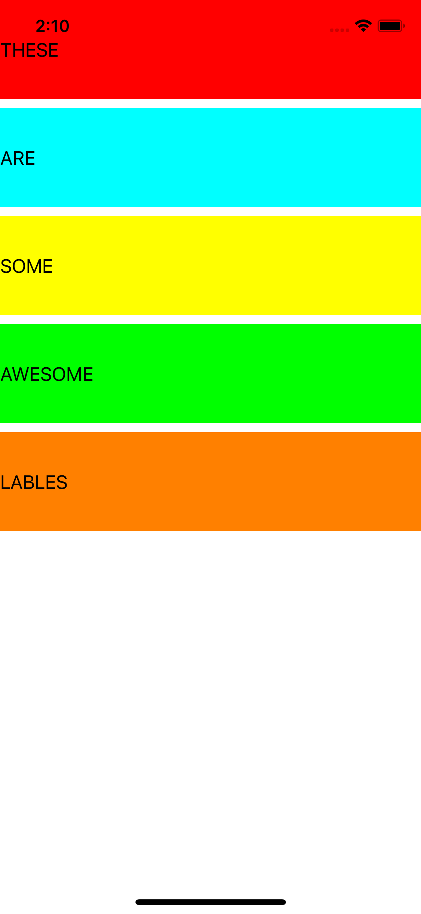

# LayoutCheck

This app helps understand how layout works. Visual format and Anchors

## Tools implemented in project

- translatesAutoresizingMaskIntoConstraints

- addSubview()

- NSLayoutConstraint.constraints(withVisualFormat:)

- :H

- :V

 ## Project Screen Shots

 

 

## More features soon

It's just playground for me

  

## Supported devices

iPhone 6S and 6S Plus.  

iPhone SE.  

iPhone 7 and 7 Plus.  

iPhone 8 and 8 Plus.  

iPhone X.  

iPhone XS, XS Max and XR.  

iPhone 11, 11 Pro and 11 Pro Max.  

## Conclusion 

the Visual Format Language is one of the ways creating layout in code, I don't think it's the best way but it appeared pretty useful. 
